# Mock Test Application

A comprehensive Laravel-based IELTS Mock Test Management System that allows administrators to create and manage mock tests, and test takers to complete tests with automated scoring for Listening and Reading sections, and manual grading for Writing and Speaking sections.

## 📋 Table of Contents

- [Features](#features)
- [Screenshots](#screenshots)
- [Technology Stack](#technology-stack)
- [Requirements](#requirements)
- [Installation](#installation)
- [Configuration](#configuration)
- [Database Schema](#database-schema)
- [Project Structure](#project-structure)
- [Usage](#usage)
- [API Routes](#api-routes)
- [Models and Relationships](#models-and-relationships)
- [Scoring System](#scoring-system)
- [Development](#development)
- [Contributing](#contributing)
- [License](#license)

## ✨ Features

### Admin Features
- **Mock Test Management**: Create, view, and manage mock tests
- **Section Management**: Organize tests into Listening, Reading, and Writing sections
- **Question Management**: 
  - Support for multiple question types (MCQ, Fill in the Blank, Multi-select, Checkbox, Table, True/False)
  - Group questions by passages or audio content
  - Add reading passages and writing prompts
- **User Registration**: Register test takers for specific mock tests
- **Answer Review**: View and review user answers
- **Scoring**:
  - Automated scoring for Listening and Reading sections
  - Manual grading interface for Writing and Speaking sections
- **Result Management**: View, update, and email test results to students
- **Student List**: View all registered students

### Test Taker Features
- **Test Registration**: Register for mock tests with personal information
- **Test Taking**: 
  - Complete Listening, Reading, and Writing sections
  - Submit answers with question tracking
- **Result Viewing**: View test results and scores

## 📸 Screenshots

### Authentication & Setup
<div align="center">
<table>
<tr>
<td align="center" width="33.33%">
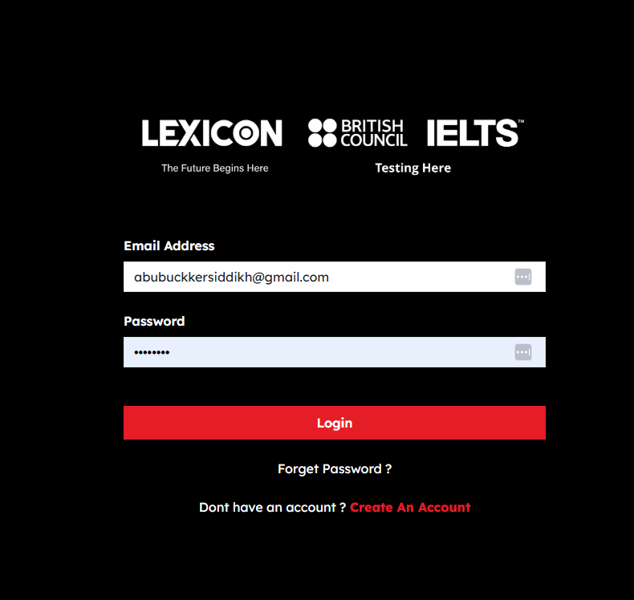
<br><strong>Login Page</strong>
</td>
<td align="center" width="33.33%">
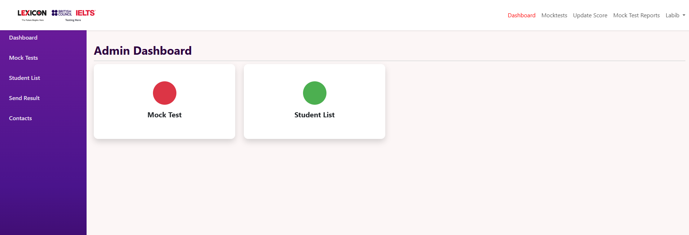
<br><strong>Dashboard</strong>
</td>
<td align="center" width="33.33%">

<br><strong>Registration</strong>
</td>
</tr>
</table>
</div>

### Initial Screens
<div align="center">
<table>
<tr>
<td align="center" width="25%">
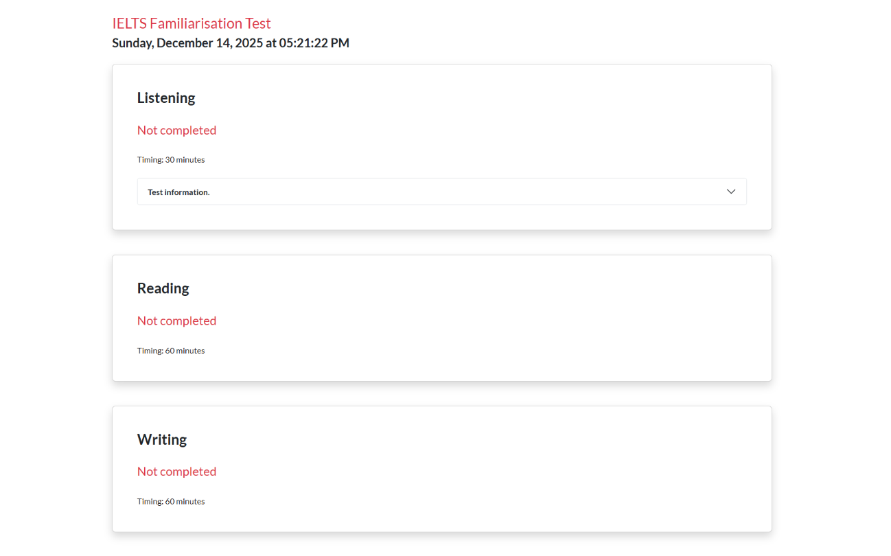
<br><strong>Initial Screen 1</strong>
</td>
<td align="center" width="25%">
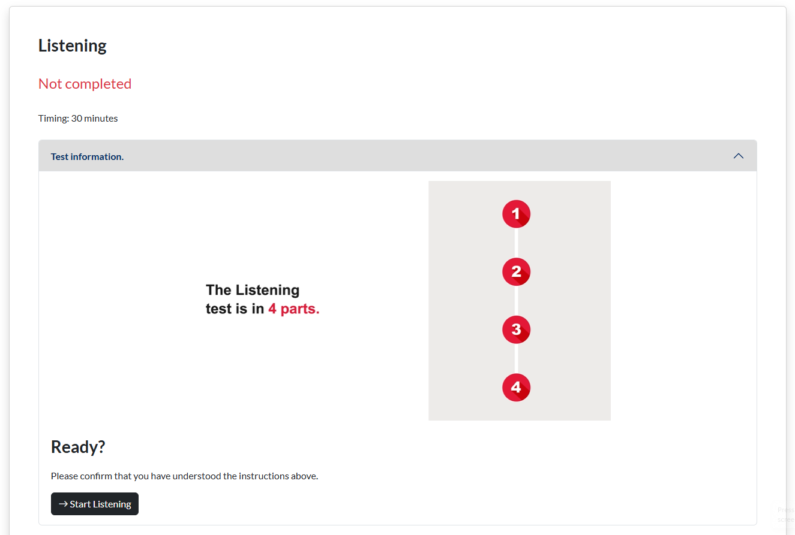
<br><strong>Initial Screen 2</strong>
</td>
<td align="center" width="25%">
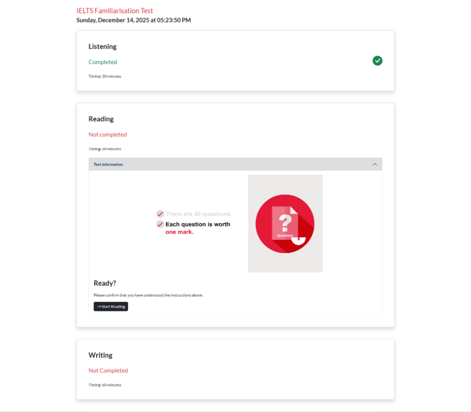
<br><strong>Initial Screen 3</strong>
</td>
<td align="center" width="25%">

<br><strong>Initial Screen 4</strong>
</td>
</tr>
</table>
</div>

### Test Sections
<div align="center">
<table>
<tr>
<td align="center" width="33.33%">
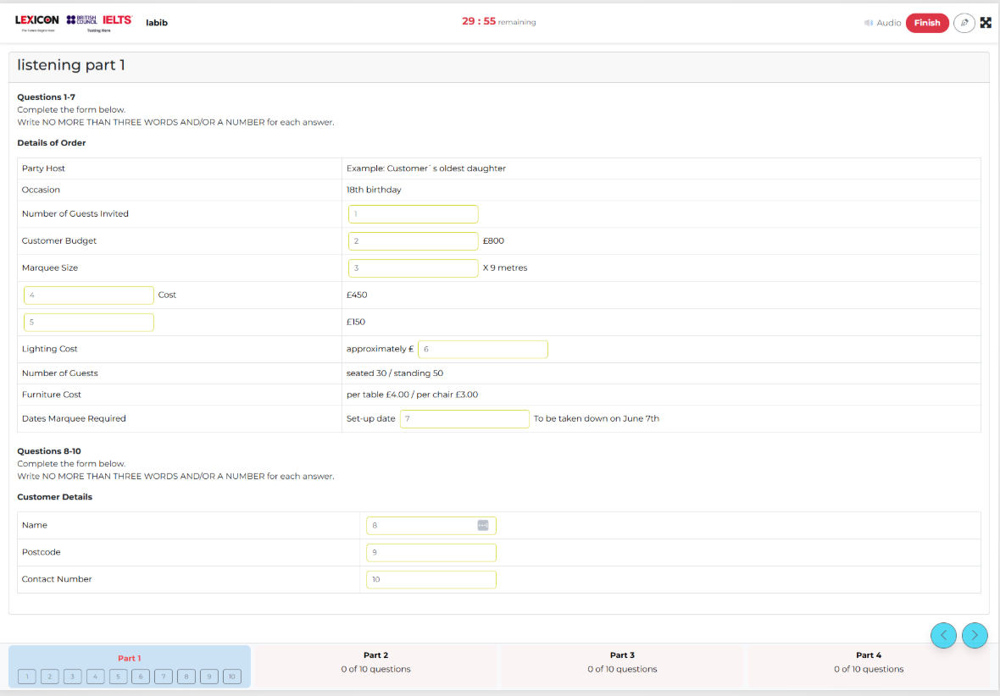
<br><strong>Listening Section</strong>
</td>
<td align="center" width="33.33%">
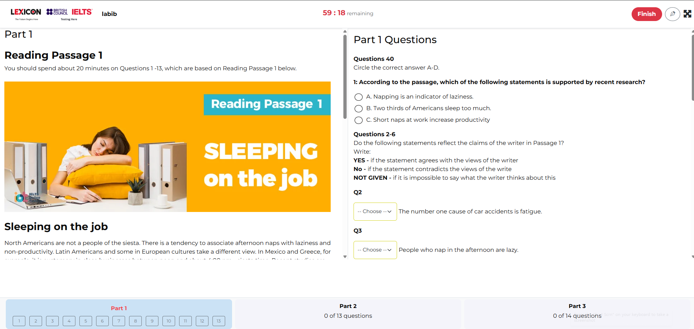
<br><strong>Reading Section</strong>
</td>
<td align="center" width="33.33%">
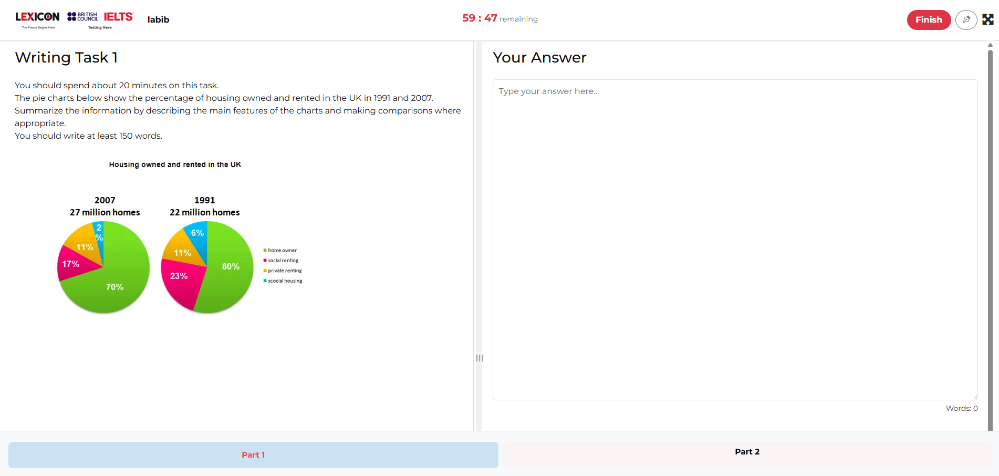
<br><strong>Writing Section</strong>
</td>
</tr>
</table>
</div>

### Results & Management
<div align="center">
<table>
<tr>
<td align="center" width="33.33%">
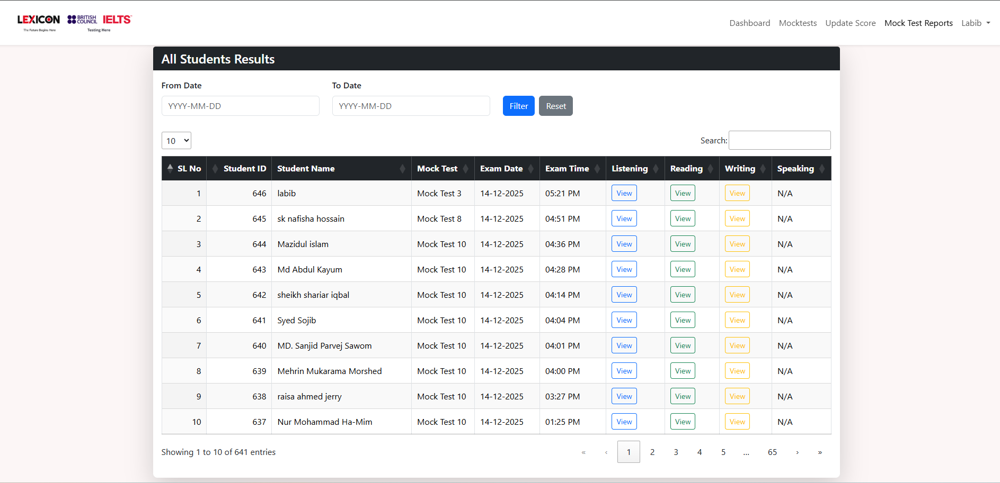
<br><strong>All Results</strong>
</td>
<td align="center" width="33.33%">
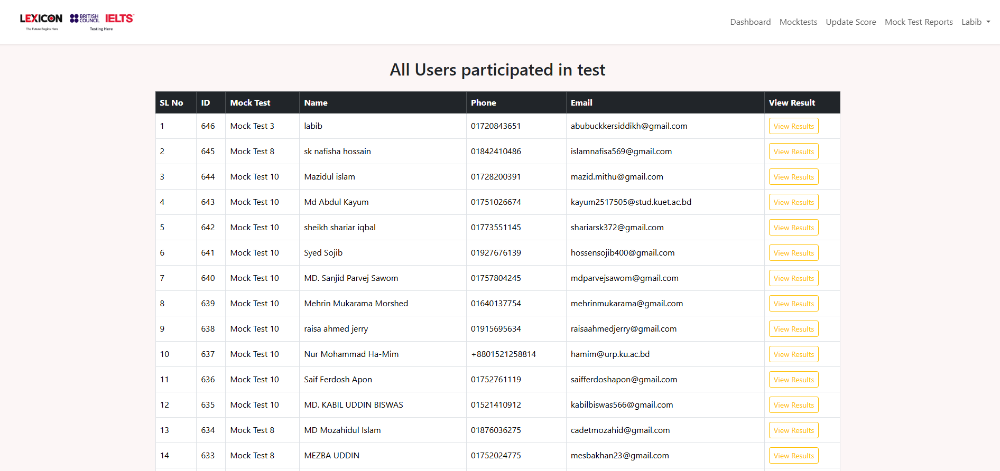
<br><strong>Student List</strong>
</td>
<td align="center" width="33.33%">
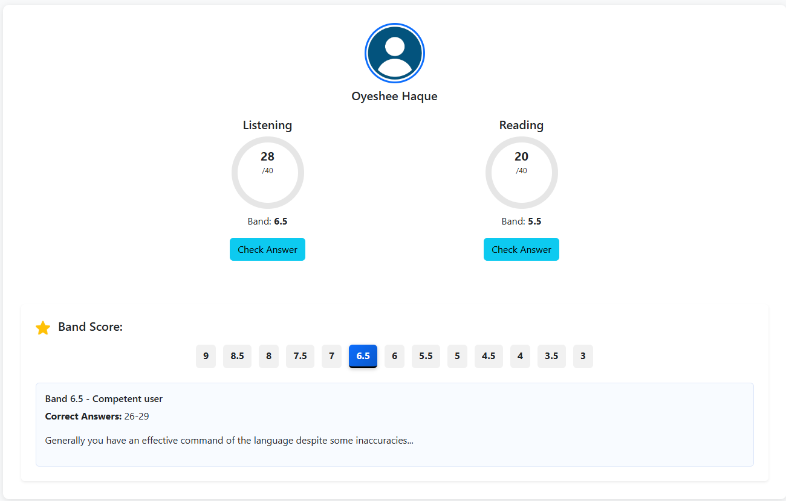
<br><strong>Score Management</strong>
</td>
</tr>
</table>
</div>

### Answers
<div align="center">
<table>
<tr>
<td align="center" width="33.33%">
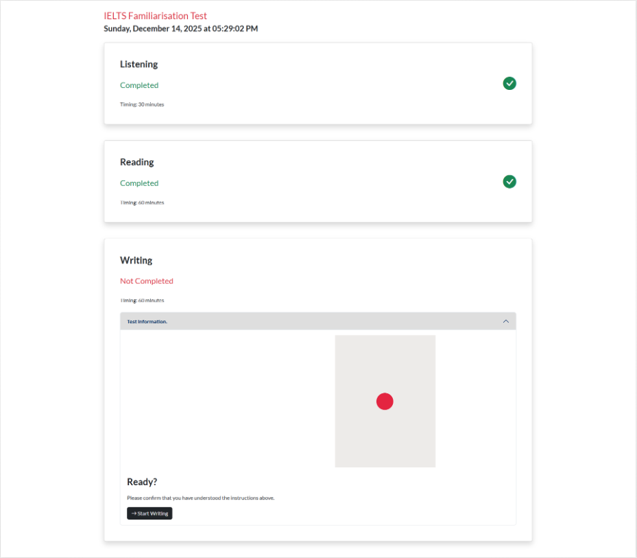
<br><strong>Answers</strong>
</td>
<td align="center" width="33.33%">
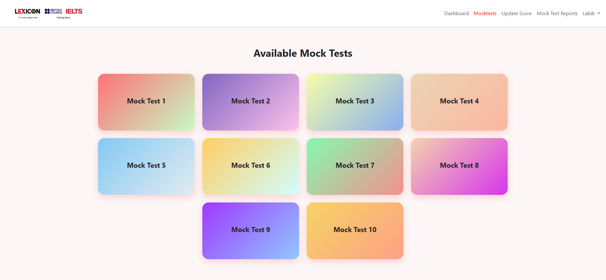
<br><strong>Mock Test</strong>
</td>
</tr>
</table>
</div>

## 🛠 Technology Stack

- **Backend Framework**: Laravel 10.x
- **PHP Version**: 8.1+
- **Database**: MySQL/MariaDB
- **Frontend**: 
  - Bootstrap 5.2.3
  - Vite (build tool)
  - Sass
- **Authentication**: Laravel UI with Sanctum
- **Image Processing**: Intervention Image 2.7
- **HTTP Client**: Guzzle 7.2

## 📦 Requirements

- PHP >= 8.1
- Composer
- Node.js and npm
- MySQL/MariaDB 5.7+ or PostgreSQL
- Web server (Apache/Nginx) or PHP built-in server

## 🚀 Installation

### 1. Clone the Repository

```bash
git clone <repository-url>
cd mocktest
```

### 2. Install PHP Dependencies

```bash
composer install
```

### 3. Install Node Dependencies

```bash
npm install
```

### 4. Environment Configuration

Copy the `.env.example` file to `.env`:

```bash
cp .env.example .env
```

Generate application key:

```bash
php artisan key:generate
```

### 5. Configure Database

Edit the `.env` file with your database credentials:

```env
DB_CONNECTION=mysql
DB_HOST=127.0.0.1
DB_PORT=3306
DB_DATABASE=mocktest
DB_USERNAME=your_username
DB_PASSWORD=your_password
```

### 6. Run Migrations

```bash
php artisan migrate
```

### 7. Seed Database (Optional)

If you have seeders:

```bash
php artisan db:seed
```

### 8. Build Frontend Assets

For development:

```bash
npm run dev
```

For production:

```bash
npm run build
```

### 9. Start Development Server

```bash
php artisan serve
```

The application will be available at `http://localhost:8000`

## ⚙️ Configuration

### Mail Configuration

Configure mail settings in `.env` for sending test results:

```env
MAIL_MAILER=smtp
MAIL_HOST=smtp.mailtrap.io
MAIL_PORT=2525
MAIL_USERNAME=your_username
MAIL_PASSWORD=your_password
MAIL_ENCRYPTION=tls
MAIL_FROM_ADDRESS=noreply@example.com
MAIL_FROM_NAME="${APP_NAME}"
```

### File Storage

Media files (audio/video) for listening sections should be stored in:
- `public/assets/audios/` for audio files
- `public/assets/videos/` for video files

Ensure the `storage` directory is linked:

```bash
php artisan storage:link
```

## 🗄 Database Schema

The application uses a hierarchical structure:

```
mock_tests
  └── sections (Listening, Reading, Writing)
      └── question_groups
          ├── questions
          │   ├── question_options
          │   └── question_answers
          ├── reading_passages (for Reading section)
          └── writing_passages (for Writing section)
```

**Test User Flow**:
```
test_users → user_answers (Listening/Reading)
          → user_writing_answers (Writing)
          → user_scores (auto-calculated)
          → ws_scores (manual grading)
```

For detailed schema documentation, see [SCHEMA_DESIGN.md](./SCHEMA_DESIGN.md)

## 📁 Project Structure

```
mocktest/
├── app/
│   ├── Console/
│   ├── Exceptions/
│   ├── Http/
│   │   ├── Controllers/
│   │   │   ├── AdminMocktestController.php  # Main admin controller
│   │   │   ├── HomeController.php
│   │   │   └── UserController.php
│   │   └── Middleware/
│   ├── Models/
│   │   ├── MockTest.php
│   │   ├── Section.php
│   │   ├── QuestionGroup.php
│   │   ├── Question.php
│   │   ├── QuestionOption.php
│   │   ├── QuestionAnswer.php
│   │   ├── ReadingPassage.php
│   │   ├── WritingPassage.php
│   │   ├── TestUser.php
│   │   ├── UserAnswer.php
│   │   ├── UserWritingAnswer.php
│   │   ├── UserScore.php
│   │   ├── WsScore.php
│   │   └── User.php
│   └── Providers/
├── database/
│   ├── migrations/          # Database migrations
│   ├── seeders/             # Database seeders
│   ├── question/            # SQL question data
│   ├── answer/              # SQL answer data
│   └── passage/             # SQL passage data
├── public/
│   ├── assets/
│   │   ├── audios/          # Audio files
│   │   ├── videos/           # Video files
│   │   ├── css/             # Stylesheets
│   │   └── js/              # JavaScript files
│   └── images/              # Image assets
├── resources/
│   ├── views/
│   │   ├── Backend/         # Admin views
│   │   ├── auth/            # Authentication views
│   │   └── layouts/         # Layout templates
│   ├── css/
│   └── js/
├── routes/
│   ├── web.php              # Web routes
│   └── api.php              # API routes
└── tests/
```

## 📖 Usage

### Admin Workflow

1. **Login**: Access admin panel at `/login` (requires Admin user type)

2. **Create Mock Test**:
   - Navigate to Mock Tests section
   - Create a new mock test with title and description

3. **Add Sections**:
   - Add Listening, Reading, and Writing sections
   - Set duration for each section

4. **Create Question Groups**:
   - For Listening: Add audio/video media files
   - For Reading: Add reading passages
   - For Writing: Add writing prompts

5. **Add Questions**:
   - Create questions within question groups
   - Select question type (MCQ, Fill Blank, etc.)
   - Add options and mark correct answers

6. **Register Test User**:
   - Register a student for the mock test
   - Collect name, phone, and email

7. **Review Answers**:
   - View submitted answers for Listening and Reading
   - Review writing answers

8. **Grade and Score**:
   - Automated scoring for Listening/Reading
   - Manual grading for Writing/Speaking
   - Update scores in the result management section

9. **Send Results**:
   - View all test results
   - Send results via email to students

### Test Taker Workflow

1. **Registration**: Admin registers the test taker
2. **Test Taking**: Complete sections in order
3. **Submission**: Submit answers for each section
4. **Results**: View results after admin grading

## 🛣 API Routes

### Web Routes

#### Admin Routes (Protected by `auth` and `user-access:Admin` middleware)

- `GET /admin/mocktests` - List all mock tests
- `GET /admin/mocktests/{mockTest}/user-info` - Show user registration form
- `POST /admin/mocktests/{mockTest}/user-info` - Save user registration
- `GET /admin/test/dashboard/{mockTest}` - Test dashboard
- `GET /admin/listening/{mockTest}` - Show listening questions
- `POST /admin/listening/{mockTest}` - Store listening answers
- `GET /admin/listening/result/{mockTest}` - Show listening results
- `GET /admin/reading/{mockTest}` - Show reading questions
- `POST /admin/reading/{mockTest}` - Store reading answers
- `GET /admin/reading/result/{mockTest}` - Show reading results
- `GET /admin/writing/{mockTest}` - Show writing questions
- `POST /admin/writing/{mockTest}` - Store writing answers
- `GET /admin/result/{mockTest}` - Show complete results
- `GET /admin/writing/{mockTest}/show` - Show writing answers
- `GET /admin/mocktest-result` - List all test results
- `GET /admin/mocktest/score/update` - Show score update form
- `POST /admin/mocktest/score/update` - Update scores
- `GET /admin/student-list` - List all students
- `GET /admin/mocktest/result` - Show results to send
- `POST /result/{user}/send-mail` - Send result email

#### Authenticated Routes

- `GET /dashboard` - User dashboard
- `GET /users` - List users (resource routes)
- `PUT /profile-update/{id}` - Update user profile
- `PUT /profile-password-reset/{id}` - Reset password

### API Routes

- `GET /api/user` - Get authenticated user (Sanctum protected)

## 🔗 Models and Relationships

### Core Models

#### MockTest
- `hasMany` Section
- `hasMany` TestUser

#### Section
- `belongsTo` MockTest
- `hasMany` QuestionGroup
- `hasMany` UserScore
- `hasMany` UserAnswer
- `hasMany` UserWritingAnswer

#### QuestionGroup
- `belongsTo` Section
- `hasMany` Question
- `hasOne` ReadingPassage (optional)
- `hasOne` WritingPassage (optional)
- `hasMany` UserWritingAnswer

#### Question
- `belongsTo` QuestionGroup
- `hasMany` QuestionOption
- `hasMany` QuestionAnswer
- `hasMany` UserAnswer

#### QuestionOption
- `belongsTo` Question
- `hasMany` QuestionAnswer
- `hasMany` UserAnswer

#### TestUser
- `belongsTo` MockTest
- `hasMany` UserAnswer
- `hasMany` UserWritingAnswer
- `hasMany` UserScore
- `hasOne` WsScore

#### UserAnswer
- `belongsTo` TestUser
- `belongsTo` MockTest
- `belongsTo` Section
- `belongsTo` Question
- `belongsTo` QuestionOption

#### UserWritingAnswer
- `belongsTo` TestUser
- `belongsTo` Section
- `belongsTo` QuestionGroup

#### UserScore
- `belongsTo` TestUser (logical)
- `belongsTo` Section (logical)

#### WsScore
- `belongsTo` TestUser

## 📊 Scoring System

### Automated Scoring (Listening & Reading)

Scores are calculated based on correct answers:
- System compares `user_answers` with `question_answers`
- Calculates correct count per section
- Stores result in `user_scores` table
- Uses IELTS band conversion (0-9 scale)

**Band Conversion Example**:
- 39+ correct → Band 9
- 37-38 correct → Band 8.5
- 35-36 correct → Band 8
- ... (see controller for full conversion table)

### Manual Scoring (Writing & Speaking)

- Admin reviews `user_writing_answers`
- Manually assigns scores (0-9) for Writing and Speaking
- Scores stored in `ws_scores` table
- Can be updated via admin interface

## 🧪 Development

### Running Tests

```bash
php artisan test
```

### Code Style

The project uses Laravel Pint for code formatting:

```bash
./vendor/bin/pint
```

### Database Migrations

Create a new migration:

```bash
php artisan make:migration create_table_name
```

Run migrations:

```bash
php artisan migrate
```

Rollback migrations:

```bash
php artisan migrate:rollback
```

### Creating Models

```bash
php artisan make:model ModelName
```

### Creating Controllers

```bash
php artisan make:controller ControllerName
```

## 🔒 Security Features

- Authentication via Laravel UI
- Role-based access control (Admin/User)
- Password hashing
- CSRF protection
- SQL injection prevention (Eloquent ORM)
- XSS protection (Blade templating)

## 📝 Notes

- Question types support flexible metadata via JSON field
- Media files should be uploaded to `public/assets/` directories
- Session-based test tracking for test takers
- Email functionality requires proper mail configuration

## 🤝 Contributing

1. Fork the repository
2. Create a feature branch (`git checkout -b feature/amazing-feature`)
3. Commit your changes (`git commit -m 'Add some amazing feature'`)
4. Push to the branch (`git push origin feature/amazing-feature`)
5. Open a Pull Request

## 📄 License

This project is open-sourced software licensed under the [MIT license](https://opensource.org/licenses/MIT).

## 👥 Authors

- Your Name/Organization

## 🙏 Acknowledgments

- Laravel Framework
- Bootstrap
- All contributors and testers

---

For detailed database schema information, please refer to [SCHEMA_DESIGN.md](./SCHEMA_DESIGN.md)
